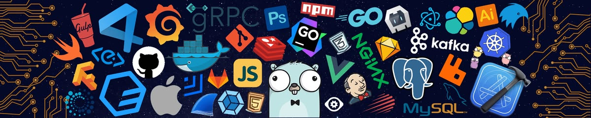

  

                                                           
                                                    
                                                                   
                                                                   Hi there 👋 

🎓 Final-year CSE Student ⚡ Full-Stack & AI Developer 🧩 DSA | Java 🌱 Always learning, always building 🚀 Shipping projects with purpose

## 🌐 Socials:
  

# 💻 Tech Stack:
                             
# 📊 GitHub Stats:
 
 

### ✍️ Random Dev Quote

---

<!-- Proudly created with GPRM ( https://gprm.itsvg.in ) -->
